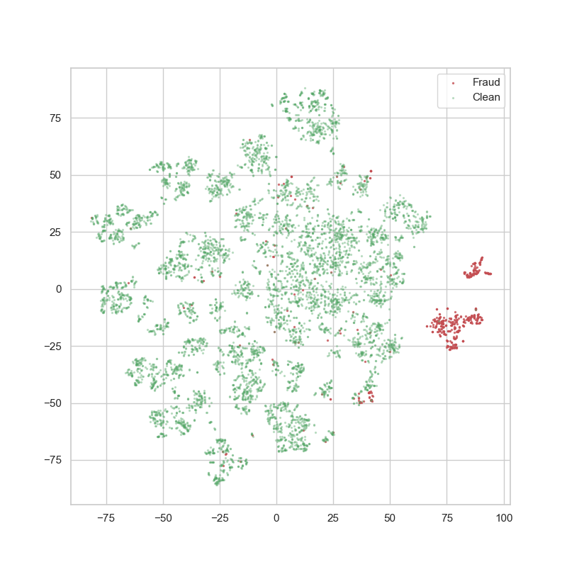
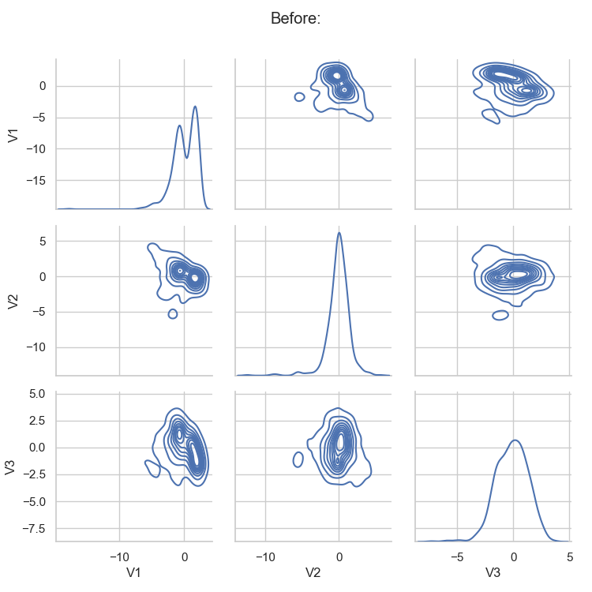
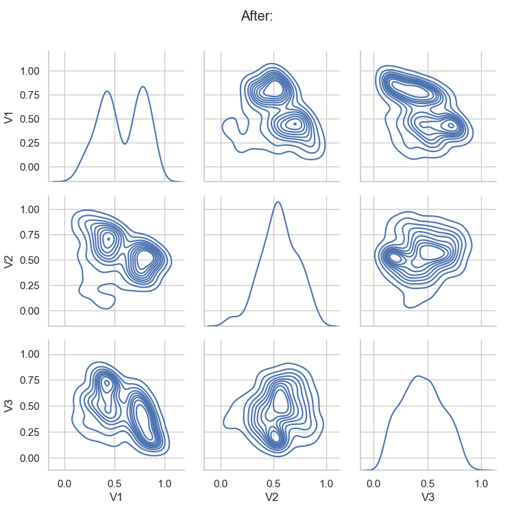
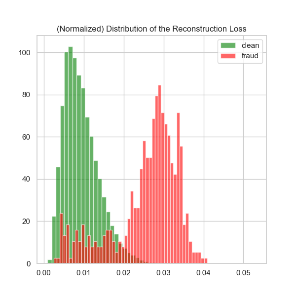

## Detection of Fraud transaction using AutoEncoders

- main.ipynb is the main notebook to carryout data analysis, vizualize data and train the autoencoder
- util.py has helper function to plot TSNE , transformation pipelines

## t-SNE 2D data Visualization
### Data of 30 features displayed in 2D plot

## KDE plot of multivariate countor distribution of 3 features before Normalization

## KDE plot of multivariate countor distribution of 3 features After Normalization with sample mean and variance

## Distribution of Reconstruction Loss

